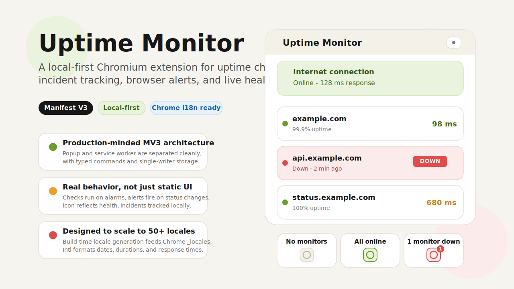
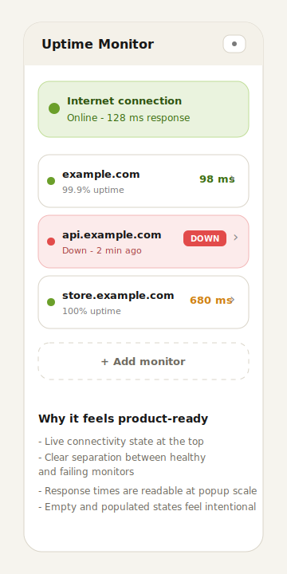
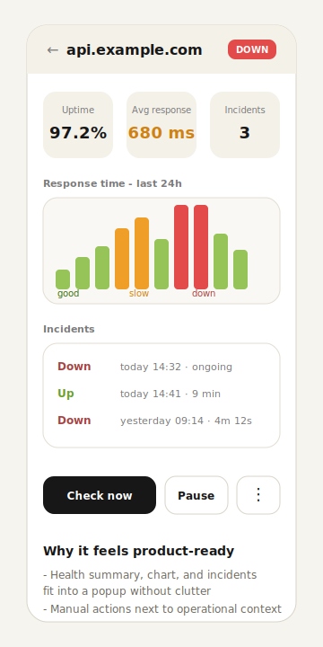
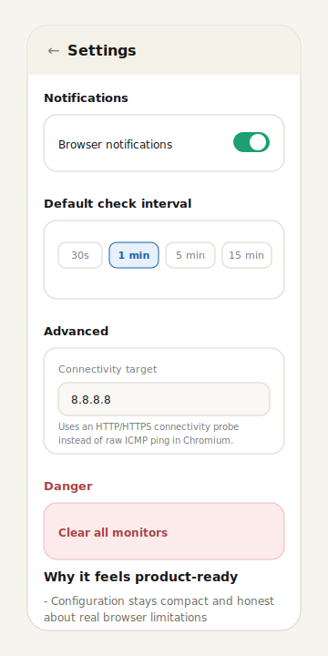

# Uptime Monitor

<p align="center">
  
</p>

<p align="center">
  
  
  
  
  
</p>

Мониторинг сайтов, API и хостов — прямо из браузера. Без сервера, без аккаунта, без компромиссов с платформой.

Это полноценное Manifest V3 расширение: popup и service worker разделены как положено, записью в storage управляет только background-слой, проверки идут через `chrome.alarms`, алерты — через `chrome.notifications`, иконка расширения отражает текущее состояние мониторов.

---

## Скриншоты

<table>
  <tr>
    <td align="center">
      
    </td>
    <td align="center">
      
    </td>
    <td align="center">
      
    </td>
  </tr>
  <tr>
    <td align="center"><strong>Dashboard</strong><br/>Список мониторов, internet status</td>
    <td align="center"><strong>Details</strong><br/>24h chart, incidents, действия</td>
    <td align="center"><strong>Settings</strong><br/>Интервалы, уведомления, network</td>
  </tr>
</table>

---

## Архитектура

FSD (Feature-Sliced Design) с чёткими границами между popup и background:

```
src/
  app/         точка входа popup, навигация
  pages/       экраны popup
  widgets/     составные UI-блоки
  features/    пользовательские действия, side effects
  entities/    доменные типы, selectors, hooks
  shared/      helpers, UI primitives, i18n, constants
  background/  service worker, runtime команды, проверки
```

### Поток данных

```
Popup action → typed command → background validates → chrome.storage.local
                                                              ↓
                                         storage.onChanged → Popup re-renders
                                         chrome.alarms     → checks run
                                         chrome.notifications → alerts fire
                                         action icon       → reflects health
```

---


## Стек

React 19 · TypeScript 5.9 · Vite 8 · @crxjs/vite-plugin · zod · CSS Modules
`chrome.storage` · `chrome.alarms` · `chrome.notifications` · `chrome.i18n`

---

## Запуск

```bash
npm install
npm run dev    # popup в браузере без extension context
npm run build  # production → dist/
```

Загрузка в Chrome: `chrome://extensions` → Developer mode → Load unpacked → `dist/`

Работает в Chrome, Edge, Brave и любом Chromium-браузере.
